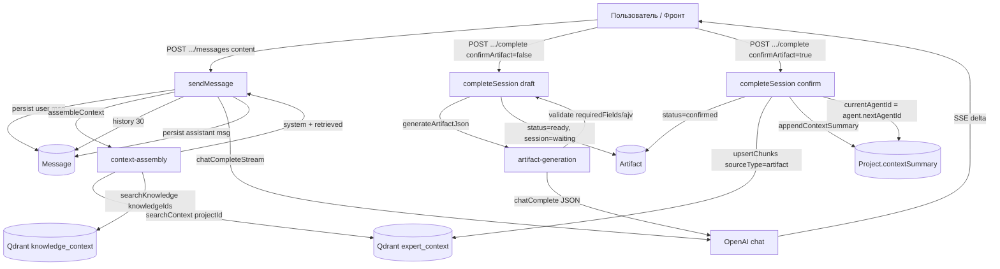
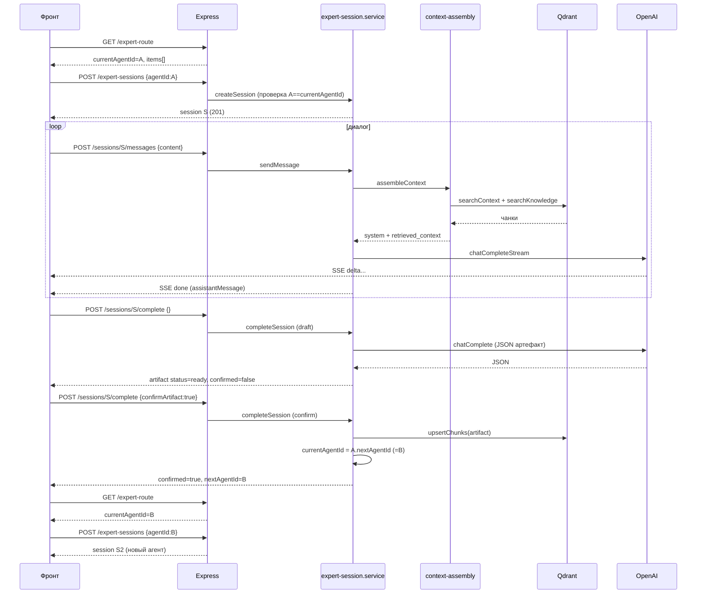

# Разбор работы «Акселератора» под капотом (для ревью)

> **Статус: часть описанных ниже проблем уже исправлена.** Документ сохранён
> как снимок состояния на момент ревью — по нему видно, что именно было не так.
> Что с тех пор сделано (см. `docs/expert-context.md`, актуальное описание там):
>
> - реализован серверный гейт готовности этапа (требование DONE-4) —
>   `completion-evaluation.service.js`, ошибка `409 STAGE_NOT_READY`;
> - задействованы прежде мёртвые поля `completionEvaluatorPrompt` и
>   `allowPartialCompletion`;
> - артефакт этапа теперь PDF: модель пишет текст, сервер верстает и кладёт в S3;
> - генерация структурированных полей переведена на `response_format:
>   json_object` (устранён ложный `ARTIFACT_VALIDATION_FAILED`);
> - добавлена перегенерация черновика (`regenerate:true`);
> - исправлен баг истории диалога: в контекст уходили **первые** 30 сообщений
>   вместо последних.
>
> По итогам второго прохода ревью исправлено также:
>
> - завершённый маршрут больше не «воскресает» (самолечение
>   `resolveCurrentAgent` применяется только к свежим проектам);
> - подтверждение с «висячим» `nextAgentId` отклоняется
>   (`409 NEXT_AGENT_UNAVAILABLE`) до любых мутаций;
> - запрещена самоссылка `nextAgentId` в админ-CRUD
>   (`400 NEXT_AGENT_SELF_REFERENCE`); existence-check у `nextAgentId`,
>   вопреки первой версии этого документа, был реализован и раньше;
> - в Qdrant индексируется `documentMarkdown` артефакта вместо
>   `JSON.stringify(content)`;
> - обновлена устаревшая `docs/open-questions.md` (эмбеддинги, провайдеры).
>
> **Остаётся актуальным:** разъезд двух LLM-провайдеров ловится только на
> рантайме (стартового пинга обоих клиентов нет) — см. предупреждение в
> `docs/open-questions.md` и `.env.example`.

> Документ описывает, как сейчас реально работает экспертный контур
> Р-Акселератора: как данные текут **от пользователя к агенту**, **от агента
> к агенту** и **от агента к артефакту**. В конце — раздел «Где это ломается»
> с привязкой к трём вашим гипотезам (бэк / галлюцинация модели / фронт).
>
> Все ссылки вида `file.js:NN` кликабельны в редакторе.

---

## 0. TL;DR — краткие выводы для ревью

Backend-логика **сама по себе корректна** и покрыта интеграционным тестом
(`src/__tests__/accelerator/expert-session.test.js`), который проходит весь
маршрут R1→R2 с переключением агента и генерацией артефакта — но **при
замоканных LLM и эмбеддингах**. То есть код склейки работает; ломается,
скорее всего, на стыках с реальными провайдерами и с фронтом. Ключевые
подозреваемые, по убыванию вероятности:

1. **Переключение агентов не автоматическое и требует ДВА явных вызова
   `/complete` от фронта.** Ни модель, ни сервер не решают «этап завершён».
   Нет никакого авто-гейта. Если фронт не вызывает `POST .../complete`
   (сначала без `confirmArtifact`, потом с `confirmArtifact:true`) — артефакт
   не создаётся и `currentAgentId` не двигается **никогда**. Это главный
   кандидат под «переключения не происходит». См. §3 и §6.

2. **`nextAgentId` у агента может быть не задан.** Переключение делает
   `project.currentAgentId = agent.nextAgentId || null`
   (`expert-session.service.js:236`). Если админ завёл агентов через CRUD и не
   проставил `nextAgentId` — маршрут заканчивается на первом агенте, проект
   уходит в `completed`. Сервер **не валидирует** связность маршрута.

3. **Конфликт провайдеров LLM.** Чат и генерация артефакта идут на **прямой
   OpenAI** (`config/openai.config.js`, ключ `OPENAI_API_KEY`,
   `api.openai.com`), а эмбеддинги — на **OpenRouter**
   (`config/openrouter.config.js`). Если в `OPENAI_API_KEY` лежит ключ
   OpenRouter (а `.env.example:67` прямо предупреждает, что так делать нельзя)
   — все чат-вызовы и генерация артефакта падают с 401 → `LLM_PROVIDER_FAILED`.

4. **Генерация артефакта хрупкая: нет `response_format: json_object`.**
   Артефакт просят у модели простой текстовой инструкцией «верни строго JSON»
   (`artifact-generation.service.js:44-63`). Никакого принудительного
   JSON-режима. `gpt-4o-mini` периодически добавляет пояснения/markdown → 
   `JSON.parse` падает → `ARTIFACT_VALIDATION_FAILED`. Плюс жёсткая проверка
   `requiredFields`: если в диалоге не собрали хоть одно обязательное поле,
   модель оставит его пустым → та же ошибка. Это кандидат под «артефакт не
   формируется» даже когда сеть и ключи в порядке.

5. **Документация рассинхронена с кодом** (`docs/open-questions.md` всё ещё
   пишет про `text-embedding-3-small`/1536 и «OpenRouter удалён», хотя код
   использует OpenRouter + `google/gemini-embedding-2`/3072). Это не баг
   рантайма, но сбивает при диагностике и деплое.

Быстрый способ отделить «бэк» от «фронта»: воспроизвести цепочку четырьмя
curl-запросами из §7. Если curl-цепочка переключает агента и создаёт артефакт
— виноват фронт; если падает — смотрите код ошибки из §8.

---

## 1. Из чего собран сервис

### Хранилища (источники данных)

| Хранилище | Что хранит | Роль |
|---|---|---|
| **MongoDB** | `Project`, `Agent`, `ExpertSession`, `Message`, `Artifact`, `Knowledge` | Источник истины |
| **Qdrant** | Векторы чанков: коллекции `expert_context` (по `projectId`) и `knowledge_context` (по `knowledgeId`) | Поисковый индекс для RAG |
| **S3** | Бинарные файлы проекта | Файл попадает в контекст только через извлечённый текст |
| **OpenAI** (`config/openai.config.js`) | — | **Чат агентов + генерация артефакта** |
| **OpenRouter** (`config/openrouter.config.js`) | — | **Только эмбеддинги** (`google/gemini-embedding-2`) |

### Модели (`src/models/accelerator/`)

- **`Agent`** (`agent.model.js`) — generic, админ-настраиваемый агент. Ключевые
  для потоков поля: `systemPrompt`, `completionCriteria`, `artifactDefinition`
  (`artifactType`, `requiredFields`, `outputSchema`, `summaryField`),
  `nextAgentId` (маршрутизация), `order` (позиция), `contextPolicy` (что
  подмешивать в промпт), `knowledgeIds`, `modelConfig` (`model`, `temperature`,
  `maxTokens`).
  - ⚠️ Поля `completionEvaluatorPrompt` и `allowPartialCompletion`
    **объявлены в модели/схеме/Swagger, но нигде в логике не используются**
    (проверено grep'ом). То есть «модель-оценщик завершённости этапа» и
    «частичное завершение» — это задел, а не работающая фича.
- **`Project`** (`project.model.js`) — среди прочего `currentAgentId` (кто
  сейчас активен), `completedAgentIds` (пройденные), `contextSummary`
  (накопительная сводка, всегда идёт в промпт), `contextVersion`.
- **`ExpertSession`** (`expert-session.model.js`) — диалог проекта с одним
  агентом. `status`: `draft`/`active`/`waiting_user_confirmation`/`completed`/
  `failed`. `artifactId`, `inputContextSnapshot` (аудит того, что ушло в LLM),
  `outputSummary`.
- **`Message`** (`message.model.js`) — `senderType` (`user`/`assistant`/
  `system`), `content`, `tokenUsage`.
- **`Artifact`** (`artifact.model.js`) — `content` (JSON от модели, `Mixed`),
  `summary`, `title`, `type`, `status`: `draft`/`ready`/`confirmed`/`rejected`.

### Сервисы (`src/services/accelerator/`)

- **`expert-session.service.js`** — оркестратор: создание сессии, отправка
  сообщения, завершение этапа, переключение агента.
- **`context-assembly.service.js`** — сборка system-промпта + RAG-поиск.
- **`artifact-generation.service.js`** — отдельный LLM-вызов на JSON-артефакт
  + валидация.
- **`../llm.service.js`** — тонкая обёртка над OpenAI SDK: `chatComplete`
  (не-стриминг, для артефакта) и `chatCompleteStream` (SSE, для чата).
- **`../qdrant.service.js`** / **`../embedding.service.js`** — индексация и
  поиск.

### HTTP-эндпоинты (`src/routes/accelerator/project.routes.js`)

```
GET   /accelerator/projects/:projectId/expert-route                          — маршрут агентов + currentAgentId
POST  /accelerator/projects/:projectId/expert-sessions                       — создать/получить сессию для агента
POST  /accelerator/projects/:projectId/expert-sessions/:sessionId/messages   — отправить сообщение (SSE-стрим ответа)
GET   /accelerator/projects/:projectId/expert-sessions/:sessionId/messages   — история сообщений
POST  /accelerator/projects/:projectId/expert-sessions/:sessionId/complete   — завершить этап (2 фазы)
GET   /accelerator/projects/:projectId/artifacts                             — артефакты проекта
```

Все под `authMiddleware` + `checkAccessProject` (владелец проекта). Админский
CRUD агентов — отдельно, под правом `accelerator_agents.manage`.

---

## 2. Общая карта потоков



---

## 3. Поток 1: Пользователь → Агент (диалог)

Эндпоинт: `POST .../expert-sessions/:sessionId/messages`
Контроллер: `send-message.controller.js` → сервис `sendMessage`
(`expert-session.service.js:93`).

### Пошагово

1. **Предпроверки до стрима** (`send-message.controller.js:15-24`):
   `loadSessionAndAgent` находит сессию и её агента; если сессия `completed` —
   `409 SESSION_ALREADY_COMPLETED` обычным JSON. Только после этого ответ
   переключается в `text/event-stream`.
2. **Сохранение сообщения пользователя** (`:98-104`): пишется в `Message`
   (`senderType:'user'`), сразу же летит SSE-событие `message_created` — фронт
   может отрисовать сообщение оптимистично, ещё до ответа модели.
3. **Сборка контекста** — `assembleContext({ project, agent, userMessageText })`
   (`context-assembly.service.js:33`):
   - **System-промпт** склеивается на сервере из:
     `Agent.systemPrompt` → `Критерии завершения` (`completionCriteria`) →
     описание требуемого артефакта (`artifactType` + `requiredFields`) →
     `Project.contextSummary` (если `contextPolicy.includeProjectSummary`).
     Разделитель — `\n\n---\n\n`.
   - **RAG-поиск №1** (`searchContext`, коллекция `expert_context`): фильтр по
     `projectId` (граница изоляции проектов, `qdrant.service.js:118`) +
     `allowedSourceTypes`. Топ-K и лимит символов из `contextPolicy`. Если
     `includePreviousArtifacts=false` — из источников выкидывается тип
     `artifact` (`:46-48`).
   - **RAG-поиск №2** (`searchKnowledge`, коллекция `knowledge_context`):
     только если `agent.knowledgeIds` непустой; фильтр по этим id.
   - Результаты обоих поисков **не идут в system-промпт**. Они уходят
     **отдельным сообщением с ролью `user`** (`retrievedContextMessage`),
     обёрнутым в анти-инъекционную инструкцию с тегом `<retrieved_context>`
     (`context-assembly.service.js:18-24`). Это сознательная граница доверия
     (см. `docs/expert-context.md`).
   - Возвращается `contextSnapshot` — аудит того, что реально подмешалось;
     сохраняется в `session.inputContextSnapshot` после ответа (`:138`).
4. **История диалога** — `getSessionHistory` (`:82`): последние **30**
   сообщений (`HISTORY_LIMIT`), маппинг `senderType`→`role`.
5. **Итоговый массив messages** (`:109-111`):
   `[system] → [user retrieved_context]? → [...история]`.
6. **Вызов модели** — `chatCompleteStream` (`llm.service.js:24`) с
   `agent.modelConfig`. Каждый фрагмент летит SSE-событием `delta`
   (`onDelta`). Полный текст **сохраняется в `Message` только после конца
   стрима** (`:130-136`) — обрыв соединения не оставит полусообщения.
7. **Финал**: `done` c `assistantMessage`; при ошибке — `error` с
   `{ message, code }` (`send-message.controller.js:39`). Любая ошибка LLM
   нормализуется к `LLM_PROVIDER_FAILED` (`expert-session.service.js:126`).

### Что тут важно для ревью
- Диалог **никак не гейтит завершение**. `completionCriteria` — просто текст в
  промпте, сервер его не проверяет. Момент «этап готов» определяется
  **исключительно** внешним вызовом `/complete` (см. поток 3). Модель может
  сколько угодно писать «мы всё собрали», но пока фронт не дёрнет `/complete`
  — ничего не произойдёт.
- SSE-контракт фронта: события `message_created`, `delta`, `done`, `error`.
  Если фронт слушает не те имена событий или ждёт обычный JSON — «агент не
  отвечает», хотя бэк стримит корректно.

---

## 4. Поток 2: Агент → Агент (маршрутизация)

Переключение агента — это **единственный** побочный эффект второй фазы
`/complete` (`completeSession` с `confirmArtifact:true`,
`expert-session.service.js:160`). Разберём цепочку состояний.

### Как определяется «текущий агент»

`resolveCurrentAgent(project)` (`:25`):
- если `project.currentAgentId` задан — берём его;
- иначе (новый/старый проект) — **самолечение**: берём первого `isActive`
  агента по `order`, записываем в `project.currentAgentId` и сохраняем.

`GET .../expert-route` (`get-expert-route.controller.js`) отдаёт список всех
активных агентов по `order` со статусами `completed` / `current` / `locked` и
`currentAgentId`. **Фронт должен опрашивать этот эндпоинт, чтобы узнать, к
какому агенту создавать сессию.**

### Гейт при создании сессии

`createSession` (`:55`):
- агент должен существовать (`AGENT_NOT_FOUND`) и быть `isActive`
  (`AGENT_INACTIVE`);
- **агент обязан совпадать с `currentAgentId`** проекта, иначе
  `409 AGENT_NOT_CURRENT` (`:65-67`) — перепрыгнуть маршрут нельзя;
- переиспользуется существующая незакрытая сессия
  (`draft`/`active`/`waiting_user_confirmation`), либо создаётся новая.

### Само переключение (вторая фаза `/complete`)

`completeSession(..., confirmArtifact=true)` (`:217-251`):
```
artifact.status = 'confirmed'
upsertChunks(...)                              // артефакт → Qdrant
appendContextSummary(project, agent.name, ...) // summary → Project.contextSummary, contextVersion++
project.completedAgentIds.push(agent._id)
project.currentAgentId = agent.nextAgentId || null   // ← ВОТ ПЕРЕКЛЮЧЕНИЕ
if (!agent.nextAgentId) project.status = 'completed'  // конец маршрута
session.status = 'completed'
```
Ответ: `{ artifact, nextAgentId, projectContextVersion, confirmed:true }`.

### Полный цикл смены агента глазами фронта

```
1. GET  /expert-route                         → currentAgentId = A
2. POST /expert-sessions {agentId:A}          → session S
3. POST /expert-sessions/S/messages ... (n раз, диалог с A)
4. POST /expert-sessions/S/complete {}                    → artifact ready, session=waiting_user_confirmation
   (currentAgentId ВСЁ ЕЩЁ = A — это НЕ переключение)
5. POST /expert-sessions/S/complete {confirmArtifact:true}→ currentAgentId = B, session=completed
6. GET  /expert-route                         → currentAgentId = B  (нужно перечитать!)
7. POST /expert-sessions {agentId:B}          → НОВАЯ session S2
```

### Где переключение реально не случится
- **Фронт не делает шаг 5** (только шаг 4, или вообще не вызывает `/complete`)
  → агент не меняется. `waiting_user_confirmation` — это не «завершено».
- **`agent.nextAgentId === null`** (админ не связал агентов) → шаг 5 отработает,
  но `currentAgentId` станет `null`, а проект — `completed`. Внешне выглядит как
  «маршрут закончился на первом агенте». Сервер связность **не проверяет**.
- **Фронт не перечитывает `/expert-route` (шаг 6) и не создаёт новую сессию
  (шаг 7)** — остаётся в старой `completed`-сессии, любое сообщение туда даёт
  `409 SESSION_ALREADY_COMPLETED`. Выглядит как «всё зависло на первом агенте».

---

## 5. Поток 3: Агент → Артефакт

Артефакт **не парсится из чата**. Он создаётся отдельным, не-стриминговым
LLM-вызовом при `/complete`.

### Фаза A — черновик (`confirmArtifact` отсутствует/false), `:165-214`
1. Если у сессии уже есть `artifactId` — берём готовый (повторный вызов не
   генерирует заново).
2. Иначе: `assembleContext` (тот же system-промпт, но `userMessageText =
   agent.completionCriteria`) + история диалога → `generateArtifactJson`
   (`artifact-generation.service.js:44`):
   - messages: `[system] → [retrieved_context]? → [...история] → [user:
     "Сформируй финальный артефакт ... СТРОГО валидным JSON ... поля: ..."]`;
   - `chatComplete` (не-стрим);
   - `stripCodeFence` + `JSON.parse`; провал → `ARTIFACT_VALIDATION_FAILED`;
   - `validateArtifactContent`: объект? все `requiredFields` непустые? опц.
     `ajv` по `outputSchema` (если схема сама кривая — проверка тихо
     пропускается, `:30-34`);
   - `summary` = `content[summaryField]` или обрезка JSON до 500 симв.;
     `title` = `titleTemplate` или `"{agent.name}: {artifactType}"`.
3. Создаётся `Artifact` (`status:'draft'`), сразу пишется `session.artifactId`
   и сохраняется в БД **до** любой записи в Qdrant (`:197-203`) — чтобы retry
   после сбоя Qdrant не сгенерировал дубль.
4. `artifact.status='ready'`, `session.status='waiting_user_confirmation'`,
   `session.outputSummary=summary`. **`currentAgentId` не трогается.**
   Ответ: `{ artifact, nextAgentId:null, ..., confirmed:false }`.

### Фаза B — подтверждение (`confirmArtifact:true`)
См. §4: `confirmed` → Qdrant → `contextSummary` → переключение агента.

### Обработка ошибок (`:174-184`)
- `ARTIFACT_VALIDATION_FAILED` → `422` (реально кривой/неполный JSON).
- Любая другая ошибка генерации (сеть, лимит, авторизация) → `502
  LLM_PROVIDER_FAILED`. Специально не маскируется под «артефакт невалиден».
- Сбой записи в Qdrant во второй фазе → `502 QDRANT_INDEX_FAILED`, но
  артефакт уже `confirmed` в Mongo, а вот **переключение агента до этой строки
  не дойдёт** (`upsertChunks` бросает раньше `currentAgentId=...`). Значит при
  падающем Qdrant артефакт «есть», а маршрут не двигается — важный нюанс.

### Слабые места генерации (кандидаты под «артефакт не формируется»)
- **Нет `response_format: { type: 'json_object' }`** в `chatComplete`
  (`llm.service.js:6-18`) — надёжность JSON держится только на тексте
  инструкции. Для `gpt-4o-mini` это регулярный источник `ARTIFACT_VALIDATION_
  FAILED`.
- **Жёсткий `requiredFields`.** У демо-Романа это 5 полей
  (`marketDescription, nicheHypothesis, competitors, risks, summary`). Если
  диалог был коротким и данные не собраны — любое пустое поле роняет валидацию.
  `allowPartialCompletion` могло бы это смягчить, но **не реализовано**.
- **Контекст артефакта = история (до 30 сообщений) + RAG.** Если реальный
  сбор данных был длиннее 30 реплик или ключевые факты только в загруженных
  файлах — модель «додумывает» (галлюцинирует) недостающие поля. Валидатор
  проверяет **наличие**, но не **правдивость** (`artifact.model.js:44-49`
  прямо это оговаривает).

---

## 6. Happy path целиком (последовательность)



Именно этот сценарий проходит в тесте `expert-session.test.js` (строки
101–165) — с замоканными `chatCompleteStream`, `generateArtifactJson` (там
он не мокается целиком, но LLM под ним да) и `upsertChunks`. Значит, **склейка
корректна; проблема — на реальных провайдерах или на фронте.**

---

## 7. Как локализовать проблему за 4 запроса (curl)

Прогнать вручную (подставив токен и id). Это отделяет бэк от фронта.

```bash
BASE=https://<host>/api/v1/accelerator/projects/$PID
AUTH="Authorization: Bearer $TOKEN"

# 1. Узнать текущего агента
curl -s "$BASE/expert-route" -H "$AUTH"

# 2. Создать сессию с currentAgentId
curl -s -X POST "$BASE/expert-sessions" -H "$AUTH" -H 'Content-Type: application/json' \
  -d '{"agentId":"'$AGENT_ID'"}'

# 3. Написать агенту (SSE — смотрите, приходят ли delta/done или event: error)
curl -N -X POST "$BASE/expert-sessions/$SID/messages" -H "$AUTH" -H 'Content-Type: application/json' \
  -d '{"content":"Опиши рынок для моего проекта"}'

# 4a. Черновик артефакта
curl -s -X POST "$BASE/expert-sessions/$SID/complete" -H "$AUTH" -H 'Content-Type: application/json' -d '{}'
# 4b. Подтверждение + переключение агента
curl -s -X POST "$BASE/expert-sessions/$SID/complete" -H "$AUTH" -H 'Content-Type: application/json' \
  -d '{"confirmArtifact":true}'

# 5. Проверить, что currentAgentId сменился
curl -s "$BASE/expert-route" -H "$AUTH"
```

Интерпретация:
- Шаг 3 отдаёт `event: error` с кодом → проблема на бэке/провайдере (см. §8).
- Шаги 3–5 отработали, `currentAgentId` сменился, а в UI нет → **виноват
  фронт** (не вызывает `/complete` в две фазы / не перечитывает route / не
  создаёт новую сессию / слушает не те SSE-события).
- Шаг 4b вернул `nextAgentId:null` при `confirmed:true` → у агента **не задан
  `nextAgentId`** (данные, а не код).

---

## 8. Таблица «симптом → причина → где смотреть»

| Симптом | Вероятная причина | Код/место |
|---|---|---|
| Агент не отвечает, в SSE `event: error`, `code: LLM_PROVIDER_FAILED` | В `OPENAI_API_KEY` ключ OpenRouter, или модель `modelConfig.model` невалидна для OpenAI, или нет сети/квоты | `config/openai.config.js`, `llm.service.js:24`, `.env.example:65-69` |
| Агент отвечает, но UI ничего не рисует | Фронт слушает не те SSE-события (`message_created`/`delta`/`done`/`error`) или ждёт JSON | `send-message.controller.js:26-45` |
| `/complete` даёт `422 ARTIFACT_VALIDATION_FAILED` | Модель вернула не-JSON/markdown, либо пустое `requiredFields`-поле. Нет `response_format`, нет `allowPartialCompletion` | `artifact-generation.service.js:44-79`, `llm.service.js:6-18` |
| `/complete` даёт `502 LLM_PROVIDER_FAILED` | Сбой самого LLM-вызова генерации (ключ/сеть/квота) | `expert-session.service.js:174-184` |
| `/complete` даёт `502 QDRANT_INDEX_FAILED`, артефакт есть, агент не сменился | Qdrant/эмбеддинги упали; переключение стоит после `upsertChunks` и не выполняется | `expert-session.service.js:220-236`, `embedding.service.js` |
| Артефакт `ready`, но агент не переключается | Фронт не вызвал вторую фазу `confirmArtifact:true` | §4, `expert-session.service.js:206-215` |
| `confirmed:true`, но `nextAgentId:null`, проект `completed` | У агента не задан `nextAgentId` (админ не связал маршрут) | `expert-session.service.js:236-243`, admin CRUD |
| Новое сообщение даёт `409 SESSION_ALREADY_COMPLETED` | Фронт пишет в завершённую сессию вместо создания новой под новым агентом | §4 шаги 6–7 |
| `409 AGENT_NOT_CURRENT` при создании сессии | Фронт создаёт сессию не с тем агентом, что в `currentAgentId` | `expert-session.service.js:65-67` |
| Эмбеддинги/поиск падают на старте | Рассинхрон `EMBEDDING_DIM` (3072) с размерностью существующей коллекции Qdrant | `config/embedding.config.js`, `docs/open-questions.md` (устарел) |

---

## 9. Замечания к архитектуре (для ревью, не баги)

1. **Нет авто-детекции завершённости этапа.** `completionEvaluatorPrompt` и
   `allowPartialCompletion` — мёртвые поля. Либо реализовать модель-оценщик
   (после каждого ответа спрашивать «собраны ли все поля?» и подсказывать
   фронту, когда показать кнопку «Завершить»), либо честно убрать поля, чтобы
   не вводить в заблуждение. Сейчас весь тайминг завершения — на фронте.
2. **Хрупкая генерация JSON.** Добавить `response_format: { type:
   'json_object' }` в `chatComplete` для артефакта (и, желательно, ретрай с
   инструкцией «верни ТОЛЬКО JSON» при первом провале парсинга).
3. **Нет валидации связности маршрута.** При создании/обновлении агента стоит
   проверять, что `nextAgentId` указывает на существующего активного агента, и
   давать админке видеть «висячие» концы маршрута.
4. **Разъезд двух провайдеров легко ловит на деплое.** Стоит на старте
   логировать/пинговать оба клиента (OpenAI для чата, OpenRouter для
   эмбеддингов) и падать с внятной ошибкой, если ключ не тот.
5. **Документация устарела** (`docs/open-questions.md`): модель эмбеддингов,
   размерность, статус OpenRouter описаны неверно относительно текущего кода.
   Это напрямую мешает диагностике инфраструктурных сбоев.
6. **Контекст артефакта ограничен 30 сообщениями.** Для длинных диалогов —
   риск потери ранних фактов и, как следствие, галлюцинаций в обязательных
   полях. Стоит либо поднимать лимит для фазы генерации, либо опираться на
   RAG/summary агрессивнее.

---

*Ссылки на код проверены по состоянию ветки
`claude/accelerator-architecture-review-apce0o`.*
